### Hi there, I'm Mikhail

 **Currently**
- Head of Backend @ [SberEducation](https://www.linkedin.com/company/sbereducation/)
- Founding Engineer @ [Plural](https://plural.money)

**Previously**
- Founding Engineer @ [Oneum](https://oneum.io/)
- Software Engineer & Lead @ [Align Technology](https://www.aligntech.com/)

**Stack**

**Reach out**

[Email](mailto:the.mikhail.stepanov@gmail.com) · [Telegram](https://t.me/go_on_maggot_brain) · [LinkedIn](https://www.linkedin.com/in/mikhail-stepanovv/)

